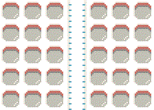

# plane-packing

Simple implementation of plane packing (as in packing people into a plane). Inspired by ['The Better Boarding Method Airlines Won't Use'](https://www.youtube.com/watch?v=oAHbLRjF0vo) video from CGP Grey.

## Usage

The main body of the code is in `plane_packing.py`. I've written some example usage into jypyter notebooks, so look at those. Some order shuffling methods are also included in `packing_orders.py`.

The plane is divided into cells and indexed by row and seat. Seat 0 is the alley. -ve seats are on the left, +ve one on the right. There are three main classes:
- `cell` which is the actual container. It knows whether there is someone in it, whether it's a seat or an alley cell and what's around it.
- `plane` which is a rectangular grid of the cells. It knows
The packing itself is done by a pretty simple routine coded 
- `actor` which is the person moving though the plane. Each actor has a destination (goal) and a basic behaviour on how to get there.

With `Packing stats 1` notebook you can do some basic statistics and with `Packing to gif` you can make some pretty gifs

## Packing orders

### Random Order
Send everyone in randomly.

### Back to front
Send people siting at the back in first. Randomize seats.

### Front to back
Send people siting at the front in first. Randomize seats.

### Windows first
Send people sitting next to the windows first. Randomize rows and left/right sides.

### Alley first
Send people sitting next to the alley first. Randomize rows and left/right sides.

The basic packing orders above compare as follows

## Ideas
A lot more can be done on this, and I'm sure there are/could be some interesting academic papers on all/any of the following:

- What is the optimal packing for other plane topologies? E.g.:
  - Hex grid
  - 3d plane where each alley cell has 4 neighboring seats (up, down, left, right)
  - Two or more alleys (actually applicable)
- Different actor behaviour. Currently I've only coded up the basicmost `shuffle` method which switches two actors around and pauses one of them for an iteration. Other behaviors which come to mind are:
  - When getting to the row, check whether the path to your seat is empty, if not then "ask" whoever is in the way to move out into the corridor.
- Actors with more actions (nimble actors)
- Unequal left and right sides
- 

## ToDo's

- Organize the code a bit better
- Add row/seat number indicators in the plane rendering
- Sprites are ok...?
- Add option for the actors to pause before entering the row to simulate putting the bag into the overhead locker